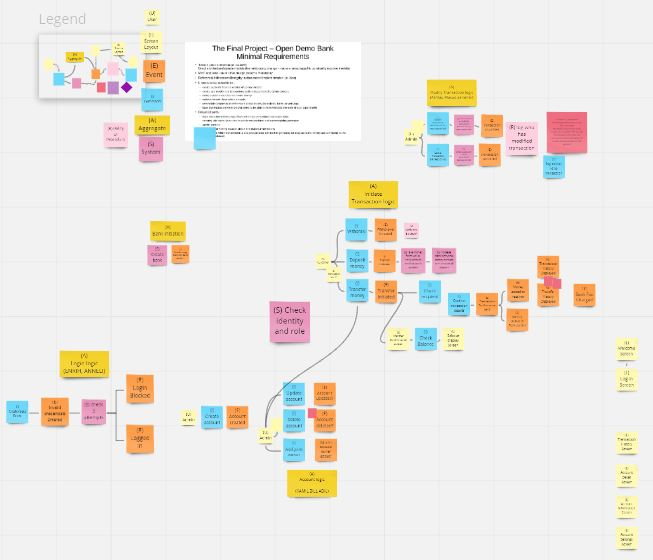

# Architecture report
**Last modified:** 13 Dec 2021

---

**Table of contents:**
- [Architecture report](#architecture-report)
  * [General information](#general-information)
    + [Contributors](#contributors)
    + [About Kaibank](#about-kaibank)
    + [User Stories](#user-stories)
    + [Personas](#personas)
  * [Data Layer](#data-layer)
    + [Event Storming](#event-storming)
    + [Class Diagram](#class-diagram)
      - [Bank Implementation](#bank-implementation)
      - [Business Users Implementation](#business-users-implementation)
        * [Enums](#enums)
      - [Business Service Implementation](#business-service-implementation)
    + [Object Diagram](#object-diagram)
  * [Design Layer](#design-layer)
    + [Wireframes](#wireframes)
    + [Front End Design](#front-end-design)
  * [Implementation Layer](#implementation-layer)
    + [Component Diagram](#component-diagram)
    + [Use Case Diagrams](#use-case-diagrams)
      - [Account Logic](#account-logic)
      - [Transaction Logic](#transaction-logic)
    + [Sequence Diagrams](#sequence-diagrams)
  * [How to Run Project](#how-to-run-project)
    + [Back End Guide](#back-end-guide)
      - [Setup local environment](#setup-local-environment)
      - [Setup database](#setup-database)
      - [Useful plugins (IntelliJ extensions)](#useful-plugins-intellij-extensions)
      - [How to build the project](#how-to-build-the-project)
    + [Front End Guide](#front-end-guide)
    + [Customer Document](#customer-document)

---

## General information

### Contributors

|   |   |   |
|---|---|---|
| Adil | Anneli  | Ashfaq |
| Bill | Boomika | Enrih  |
| Jason | Kamil | Masud |
| Matin | Pabasara | Rauno |
| Sammar | Sarp |   |

### About Kaibank
Kai means "open" in Mandarin, and KaiBank is truly an open source bank. It is the world's first no-fee bank. Deposits, withdrawals, transfers--all transactions are free for our customers.

### User Stories
Our next task was to begin writing user stories for KaiBank. This was very much an iterative process where we would envision the features of KaiBank, write user stories to capture those features, create a backlog to begin developing those features, and then go back and modify our user stories to fit our refined and enhanced vision.

A full list of user stories is located [here](user-stories.md).

### Personas
Our main users are:

- Johan Johansson, KaiBank admin
- Mike Russell, KaiBank customer service representative
- Jesse Smalls, KaiBank customer

Full user personas can be found [here](user-personas.md).

---

## Data Layer

### Event Storming

Our first task toward defining the architecture of KaiBank was to hold an event storming session. 

The entire diagram can be found [here](https://miro.com/app/board/o9J_ljct2SI=/)

---

### Class Diagram

#### Bank Implementation
The bank model works the same as with real world banks.
So far, the bank has two types of money:
   - physical
   - virtual

Whenever the bank takes physical money from the customer, it extracts that amount of money from the bank's account and transfers it to the customer's account.

#### Business Users Implementation
In the first meeting, we discussed how the system should work, and the types of users that will use the system.

The team decided to divide the system users into two types:

   - `Customer` - person who uses the system.
   - `Employee` - person who operates the system.

And there are two types of employees:
   - `Admin` 
   - `Manager`

We defined them by using a `UserRoles` model.

##### Enums

To put a boundary on models, we used several Enumerations.

#### Business Service Implementation
In our second meeting, we discussed how the system service will be implemented.
   1. Each `Customer` can have only one `Account` for payments and transfers (initially we were unsure whether we would implement a joint account feature).
   2. Each service works with `Transaction` in order to provide traceability of money, and to record all transfers that occurred on the account. 

[Link to plantuml version](/diagrams/class_diagram/class_diagram.plantuml)

---
### Object Diagram

We drew the object diagram with the help of our class diagrams and other diagrams. By doing so, we ensured that the logic of our object diagram coincides with that of our class diagram and with our actual project code.

---

## Design Layer

### Wireframes

Our front end team designed the wireframes and shared them with the rest of the team, which accepted these wireframes by the hard voting method.

We have two versions of wireframes:

- Version 1. [Here](/diagrams/wireframes/gui_wireframes_v1.jpg)
- Final version (Version 2) [Here](/diagrams/wireframes/gui_wireframes_v2.png)

**Final version:**

---

### Front End Design

The software front end was based on the final version of the wireframes. 

The Front End project uses the [React](https://reactjs.org/) framework and [MUI](https://mui.com/) for system design. The goal is to have React handle the state and have MUI provide all the ready-to-use components without much styling effort from our developers.

<iframe src="https://drive.google.com/file/d/1eKBKJIH7sf_xPBTek1nrX2aJxGiZXOC7/preview" width="640" height="480" allow="autoplay"></iframe>

[Check front end designs here.](./resources/p2p.mp4)

---

## Implementation Layer

The next step was to create use case diagrams and sequence diagrams based on our user stories. For the sake of convenience, we list the user story followed by the use case diagram and sequence diagram representing that user story. Some user stories have multiple permutations. See [this list](user-stories.md) for a detailed view.

### Component Diagram

---
### Use Case Diagrams

From our user stories, we developed the logic of our system by constructing Use Case Diagrams as a team. We decided each user story will have one use case diagram to make the implementation process easier, and to make it easy to grasp the logic of our application.

#### Account Logic

The first aspect of the system we defined was the Account framework. 

1) We created the logic where a bank employee creates an account on behalf of the customer.
   
2) We developed the scenario where a bank employee edits a customer's account details.
   
3) We developed the scenario where the customer edits their own account details. 
   
4) We developed the scenario where the customer closes his or her account.
   

---
#### Transaction Logic
1) Use case diagram for Deposit logic
   
2) Use case diagram for Withdrawal logic
   
3) Use case diagram for Transfer logic
   
4) Use case diagram for Mobile Bank Transfers
   
5) Use case diagram for changing the Transfer amount
   

6) Customer deposits money to the bank 
   
7) Customer cancels a transaction
   
8) Admin sees the transaction logs
   

---

### Sequence Diagrams

1) As a bank employee, I want to create an account on behalf of the customer.
   

2) As a bank employee, I want to modify the customer's account details.
   

   

3) As a customer, I want to modify my account details via online banking.

   

4) As a bank employee, I want to close a customer's account.

   

5) As a bank employee, I want to deposit money into a customer's account.

   

6) As a bank employee, I want to withdraw money from a customer's account at their request.

   

7) As a customer, I want to transfer money in a bank branch.

   

8) As a customer, I want to transfer money via mobile banking.

   

9) As a bank employee, I want to modify a transaction so that I can handle transaction requests.

   

10) As a Bank Employee, I want to cancel a customer’s transaction on his or her behalf.

   

11) As a bank admin, I want to see the transaction logs so that I can know by whom and when the transaction modification request is processed. 

   

## How to Run Project?
### Back End Guide

#### Setup local environment
Must install `Java 11`, `Maven 3.6.3` or above, `MySql 8` and `IntelliJ`.

#### Setup database
1. Create a database using the following SQL script:
    - `CREATE DATABASE kaibank;`
2. Create a user using the following SQL script:
    - `CREATE DATABASE kaibank;`
    - `CREATE USER 'kaibankuser'@'localhost' IDENTIFIED BY '1qaz2Wsx';`
    - `GRANT ALL ON kaibank.* TO 'kaibankuser'@'localhost';`

#### Useful plugins (IntelliJ extensions)
    
- `Spring Assistant` - assists with developing Spring applications
- `Lombok` - to remove boilerplate code
- `google-java-format` - to format the code
- `SonarLint` - to check code quality

#### How to build the project:
1. Clone the project from the repository:
    - [kaibank-backend](https://gitlab.com/pabasarajw/kaibank-backend)

2. Build the project:
        - Go to the project directory
        - Run command: `mvn clean install`

3. Run the project:
- Using IDE:
    - Open project in IntelliJ
    - Right-click on the main Spring Boot application class (`KaibankSystemApplication`) and click on Run.
- Run from terminal (as a Spring Boot project):
    - Go to the project directory
    - Run this command: `mvn spring-boot:run`

4. Access the application.

- Access the deployed application: http://localhost:8081/kaibank-system/

[Back End Repository](https://gitlab.com/pabasarajw/kaibank-backend)

---

### Front End Guide

1. Clone the project (`git clone https://gitlab.cs.ut.ee/kinlong/open-bank-web.git`)
2. `cd open-bank-web` to go into the project root directory
3. `npm install` to install dependencies
4. `npm start` to run the development server

[Front End Repository](https://gitlab.cs.ut.ee/kinlong/open-bank-web)

---
### Customer Document

<iframe src="https://drive.google.com/file/d/1eKBKJIH7sf_xPBTek1nrX2aJxGiZXOC7/preview" width="640" height="480" allow="autoplay"></iframe>

[Link to the Demo](https://drive.google.com/file/d/1eKBKJIH7sf_xPBTek1nrX2aJxGiZXOC7/preview)

### Presentation Video

Our presentation video is available [here](https://youtu.be/KVUNOUtsaz8).
